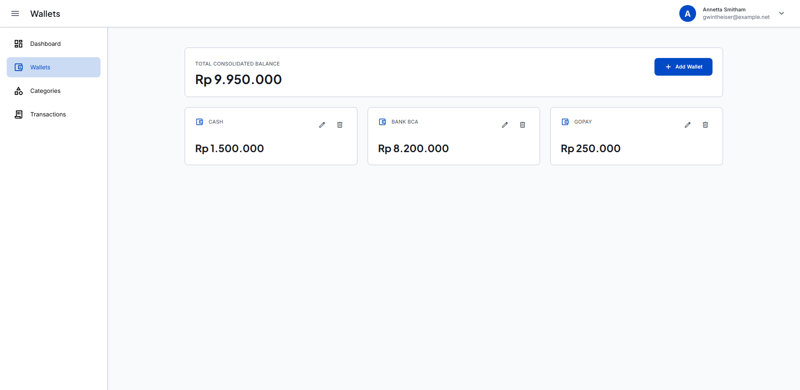
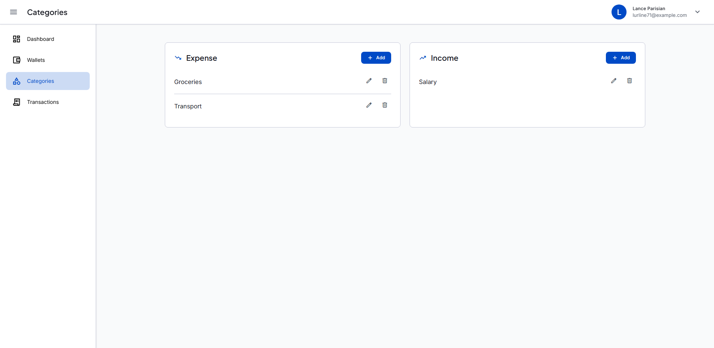
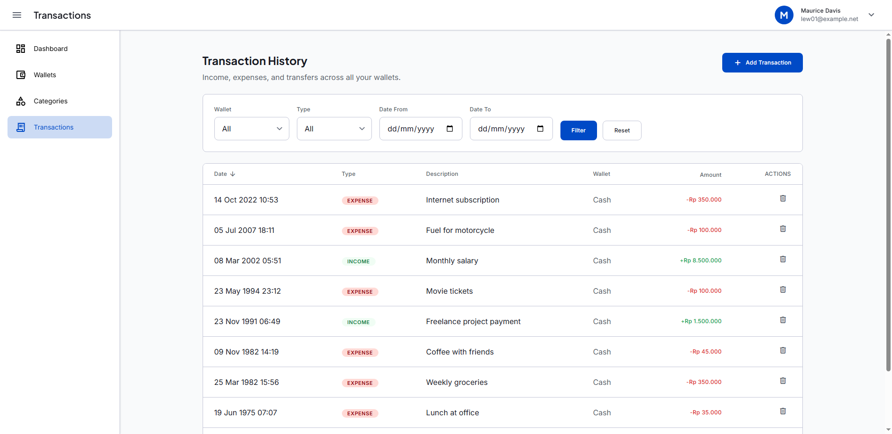
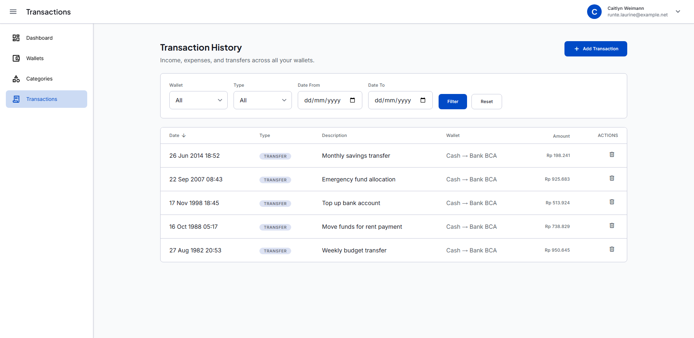
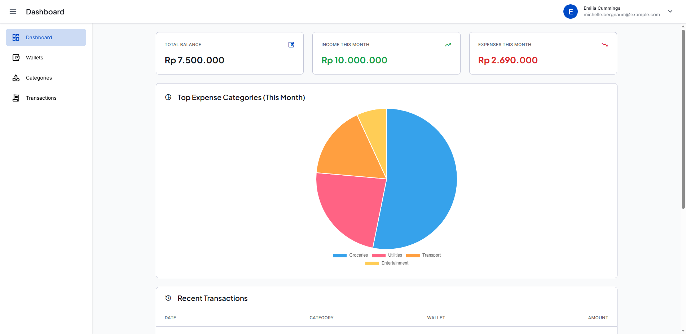
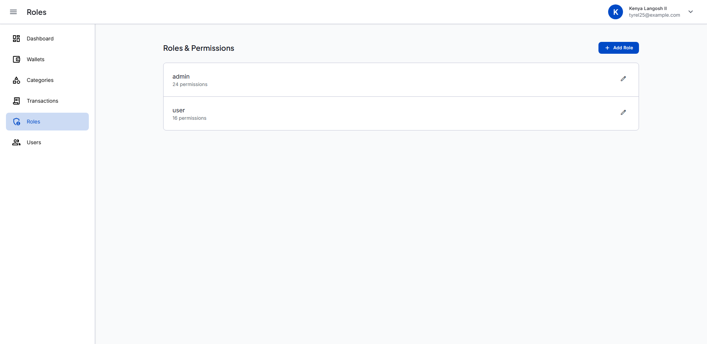
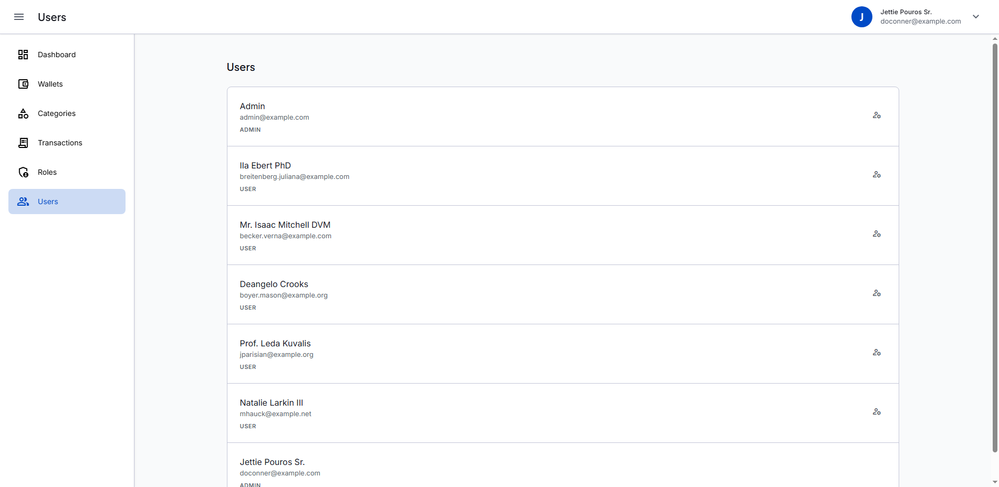

# Finance Tracker

A personal finance tracking application built with Laravel that helps users record wallets, categorize transactions, transfer money between accounts, and understand their cash flow through a real-time dashboard.

---

## Features

### Wallets
Track multiple accounts (cash, bank, e-wallet, etc.) with individual balances that stay in sync as transactions and transfers occur.



### Categories
Organize income and expenses into custom categories, each tagged with a `type` (`income` or `expense`) backed by a PHP enum for type-safe comparisons throughout the app.



### Transactions
Record income and expense entries per wallet and category, with:
- Automatic wallet balance updates
- Thousand-separator formatting on amount input for readability
- Full history view, timezone-aware (see below)



### Transfers
Move funds between the user's own wallets with proper balance adjustments on both ends.



### Dashboard
A real-time overview of the user's finances, including current balance, cash flow trends, and category breakdowns — all computed from live data via `DashboardService`.



### Role-Based Access Control (RBAC)
Admin-managed roles and permissions, with a default admin account seeded out of the box (`RolePermissionSeeder`), so access control is ready from first install.




### Timezone-Aware Datetimes
Each user's IANA timezone is detected once at login (via IP lookup) and stored server-side. All datetime input/output is converted between the user's local time and the application timezone on the server — no client-side JavaScript or per-request timezone cookies involved.

### Authentication
Full authentication flow powered by **Laravel Fortify**:

- **Registration** — with real-time password strength validation (uppercase, lowercase, number, symbol)
- **Login** — email + password with credential error feedback
- **Email Verification** — required before accessing protected routes; resend link supported
- **Forgot Password** — send reset link via email
- **Password Reset** — secure token-based reset with the same password policy as registration
- **Logout** — session termination with redirect to login

### Profile Management
Authenticated users can manage their account from the profile page:

- **Update profile** — change name and email address
- **Email change flow** — changing email triggers a re-verification step before the new address is applied
- **Change password** — requires current password; shows animated loading state and success/error feedback

---

## Why Repository Pattern?

The entire application is built on a strict **Repository Pattern** architecture:

```
Controller → Service → Repository Interface → Repository Implementation
```

- **Controllers** stay thin — they only handle HTTP concerns (requests/responses).
- **Services** hold business logic (e.g. computing balances, converting timezones, validating transfers).
- **Repository Interfaces** define a contract for data access, decoupling business logic from Eloquent.
- **Repository Implementations** are the only place that talk to the database.

This separation means each layer can be tested, replaced, or extended independently — swapping a data source, mocking a repository in tests, or reusing business logic across multiple controllers requires no rewiring of unrelated code. Every core entity (`Wallet`, `Category`, `Transaction`, `Transfer`, `User`, `Role`) follows this exact structure, so the codebase stays consistent and easy to maintain as it grows.

New CRUD modules can be scaffolded in seconds with the built-in generator, which wires up the full layer stack automatically:

```bash
php artisan make:rsc ModuleName --label="Label"
```

This generates the model, migration, repository (interface + implementation), service, controller, form requests, and Blade views (index, create, edit, show) with server-side DataTables already connected.

---

## Tech Stack

| Layer | Package | Version |
|---|---|---|
| Runtime | PHP | 8.4 |
| Framework | Laravel | v13 |
| Auth | Laravel Fortify | v1 |
| Testing | Pest | v4 |
| Browser Tests | Laravel Dusk | — |
| Frontend | Tailwind CSS | v4 |
| Bundler | Vite | — |
| Code Style | Laravel Pint | v1 |

---

## Quick Start

### Prerequisites

- PHP 8.4+
- Composer
- Node.js 18+
- MySQL (or SQLite for local dev)

### Installation

```bash
git clone https://github.com/fakhranfh/finance-tracker
cd finance-tracker
composer install
npm install
```

### One-command setup

```bash
composer run setup
```

This copies `.env.example` → `.env`, generates the app key, runs migrations, and builds frontend assets.

### Start development servers

```bash
composer run dev
```

Starts the PHP server, queue listener, and Vite dev server concurrently.

---

## Common Commands

```bash
# Development
composer run dev          # Start all servers
php artisan pail          # Stream logs in real-time

# CRUD scaffolding
php artisan make:rsc ModelName --label="Label"
php artisan delete:rsc ModelName

# Testing
php artisan test --compact
php artisan dusk

# Code style
vendor/bin/pint --dirty   # Fix formatting on changed files

# Database
php artisan migrate
php artisan db:seed
```

---

## Environment Variables

Key variables to configure in `.env`:

```env
APP_NAME="Finance Tracker"
APP_URL=http://localhost:8000

DB_CONNECTION=mysql
DB_DATABASE=finance-tracker

MAIL_MAILER=log        # Use 'smtp' in production
SESSION_DRIVER=database
QUEUE_CONNECTION=database
```

---

## License

MIT — see [LICENSE](LICENSE).
